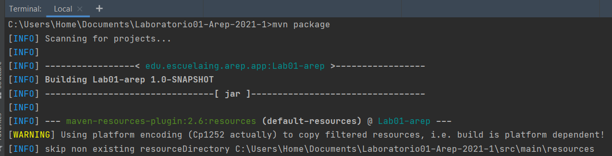
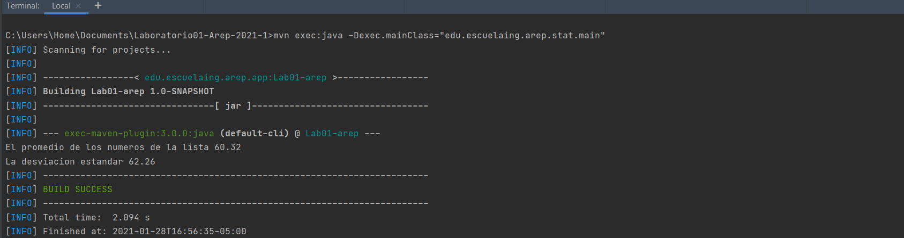
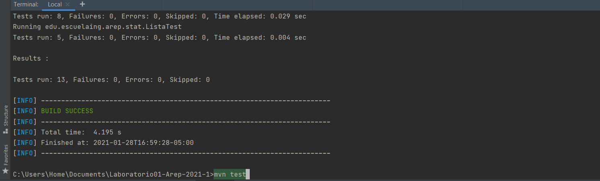
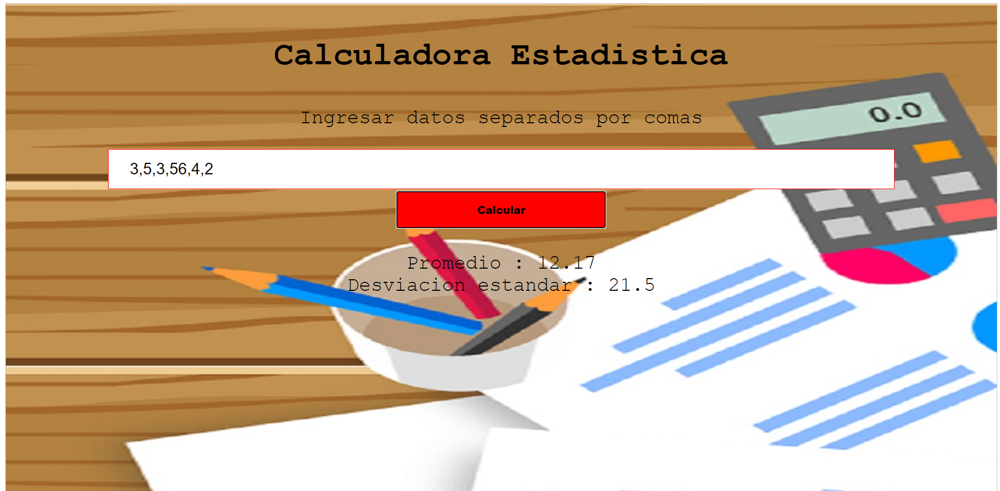

### Laboratorio02-Arep-2021-1
>

## Instalación
>
  Descargar la apliación en nuestro ordenador, con el comando :
 ```
 $ git clone https://github.com/santiagolaiton2700/Laboratorio01-Arep-2021-1
 ```
 Compilar el proyecto :
 ```
 $ mvn package
 ```
 Ejecutar el proyecto desde el metodo principal :
 ```
 $ mvn exec:java -Dexec.mainClass="edu.escuelaing.arep.stat.main"
 ```
 Ejecutar las pruebas que fueron creadas para probar el programa :
 ```
 $ mvn test
 ```
 Estructura del proyecto en forma de arbol :
 ```
 $ tree
 ```
 ## Ejecución
 >
 Muestra de la compilación del proyecto mvn package : 
 
 
 
  Muestra de la compilacion de la clase principal :
  
  
  
  Muestra de la compilacion de las pruebas con :```$ mvn test ```
  
   
   
   Ejecución del aplicativo en Heroku :
   
   [Calculadora](https://dry-cliffs-59232.herokuapp.com/)
   
   Muestra de la aplicación en ejecución : 
   
   
   ## Construido por:
   - Santiago Agustin Laiton Cubides
   - Santiago.laiton@mail.escuelaing.edu.co
   
  
  
